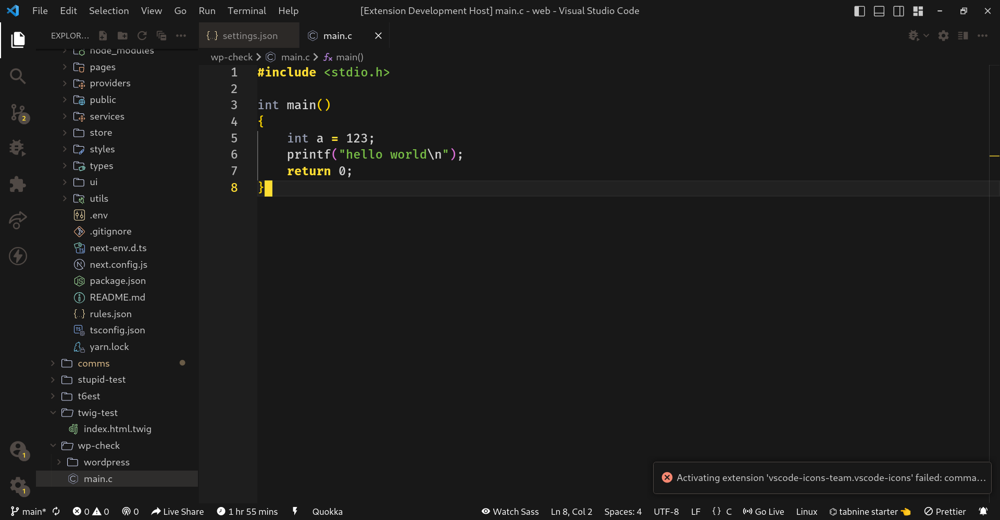

# Tsoding Theme for vscode

i liked [tsoding's]() theme so much i've recreated it



### Tsoding's theme for emacs [here](https://github.com/cofeek-codes/emacs-dotfiles/blob/main/tsoding-theme.el)

### BTW:

- icon theme - [Catppuccin Mocha](https://github.com/catppuccin/vscode-icons)
- i know that there is already a theme for vscode, but i think that my version is closer to source and more comfortable to me, maybe you will find it suitable too
- recommend you to have

```json
  "editor.cursorStyle": "block",
```

in your `settings.json`
